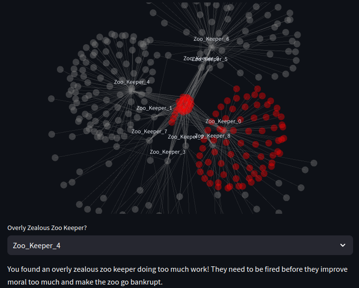

# streamlit-demo


This is a simple streamlit app that helps a local zoo manager identify overly zealous employees.

It uses undirected graphs that are presented using the kamada kawai layout algorithm.

To use the application. Ensure that packages in the requirements file are installed in the current python
environment. Then run the following command from the src directory:
```shell
streamlit run ZooApp.py
```

The app is currently hosted to streamlit [here](https://zoo-app-5cunb3rfz8yvr3eax7aqe4.streamlit.app/).
